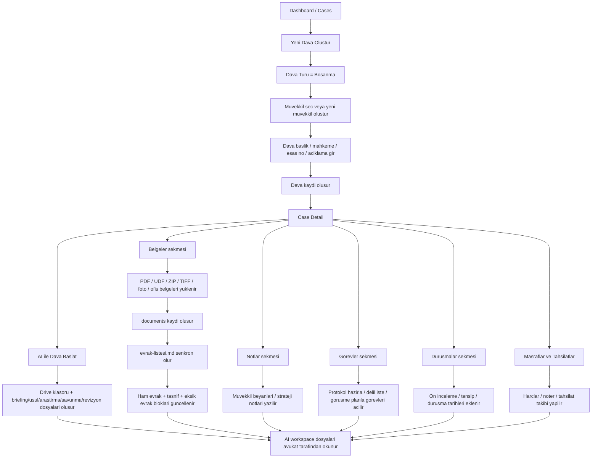
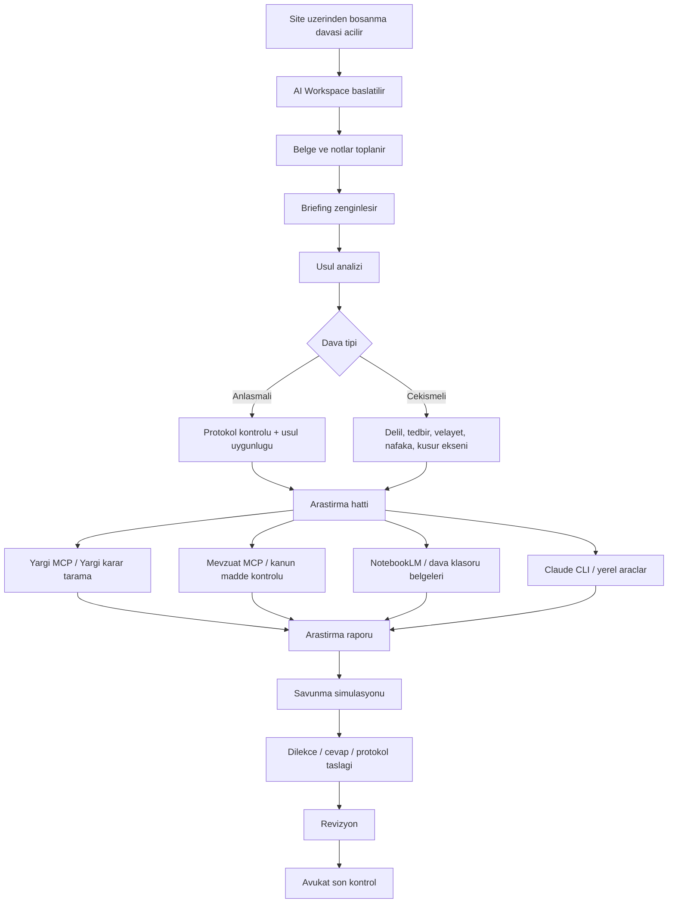

# HukukTakip Site Uzeri Bosanma Davasi Is Diyagrami

Bu belge, `ISDIAGRAMI.md` mantigini site uzerinden kullanima cevirir. Buradaki soru su:

`Bir bosanma davasini, HukukTakip arayuzu icinden adim adim nasil yuruturuz?`

Asagida iki katman var:

1. Bugun sitede fiilen calisan akis
2. Hedeflenen tam AI destekli akis

Bu ayrimi bilerek yapiyorum; cunku `ISDIAGRAMI.md` icindeki bazi halkalar hedef mimariyi anlatiyor, ama mevcut sitede bunlarin hepsi henuz tek tikla entegre degil.

## 1. Bugun Calisan Site Akisi

## 2. Bosanma Davasi Icin Site Uzeri Operasyon Sirasi

Bu kisim "siteyi acip gercekten ne yapariz" sorusunun operasyonel cevabidir.

### Asama 1: Muvekkil ve dava kaydi

1. `Clients` ekraninda muvekkil olusturulur veya mevcut muvekkil secilir.
2. `Cases > Yeni Dava` ekraninda dava acilir.
3. `Dava Turu = Bosanma` secilir.
4. Su alanlar doldurulur:
   - dava basligi
   - mahkeme
   - esas no varsa
   - aciklama
   - baslangic tarihi
5. Dava kaydedilir.

Bosanmada burada kritik not olarak su tip bilgiler aciklamaya yazilmali:

- anlasmali mi, cekismeli mi
- cocuk var mi
- velayet ihtilafi var mi
- nafaka talebi var mi
- mal paylasimi ayni dosyada mi ayri mi
- siddet, uzaklastirma, tedbir, mesaj kaydi, ihanet, terk gibi kritik basliklar var mi

### Asama 2: AI workspace baslatma

1. Dava detay ekranina girilir.
2. `AI ile Dava Baslat` butonuna basilir.
3. Sistem sunlari uretir:
   - Drive dava klasoru
   - `00-Briefing.md`
   - `01-Usul/usul-raporu.md`
   - `02-Arastirma/arastirma-raporu.md`
   - `02-Arastirma/savunma-simulasyonu.md`
   - `03-Sentez-ve-Dilekce/revizyon-raporu-v1.md`
   - `04-Muvekkil-Belgeleri/evrak-listesi.md`

Bosanma dosyasinda bu adim, fiziksel evrak ve AI calismasini ayni merkezde toplar.

### Asama 3: Belge toplama

1. `Belgeler` sekmesine girilir.
2. Muvekkilden gelen belgeler toplu sekilde yuklenir.
3. Desteklenen kritik formatlar:
   - `pdf`
   - `udf`
   - `zip`
   - `tif` / `tiff`
   - `jpg` / `jpeg` / `png` / `webp` / `heic`
   - `doc` / `docx`
   - `xls` / `xlsx`
4. Sistem her belgeyi:
   - veritabanina kaydeder
   - workspace varsa Drive klasorune yazar
   - `evrak-listesi.md` dosyasina yansitir
   - on tasnif ve eksik evrak tablosunu gunceller

Bosanma icin tipik yuklenecek belgeler:

- nufus kayit ornegi
- kimlik fotokopisi
- evlilik cuzdani / aile nufus kaydi
- cocuklara ait belgeler
- mesaj / WhatsApp ekran goruntuleri
- e-posta yazismalari
- banka hareketleri
- saglik raporlari
- uzaklastirma veya savcilik evraki
- protokol taslagi
- gelir belgeleri

### Asama 4: Avukat notlari ve strateji

1. `Notlar` sekmesinde serbest not tutulur.
2. Buraya su tip kayitlar girilir:
   - muvekkil ilk gorusme ozeti
   - karsi tarafin tutumu
   - uzlasma ihtimali
   - riskli iddialar
   - tanik isimleri
   - belge eksikleri

Bu alan bugun sistemde manuel, ama operasyon icin kritik.

### Asama 5: Gorev takibi

1. `Gorevler` sekmesinde is parcaciklari acilir.
2. Bosanma dosyasi icin tipik gorevler:
   - anlasma protokolu taslagi hazirla
   - nafaka hesabini netlestir
   - cocuk okul / saglik kayitlarini iste
   - mesaj kayitlarini kronolojik diz
   - tanik listesini hazirla
   - tedbir taleplerini ayikla

Burasi, dosyayi "tek buyuk dava" olmaktan cikarip islenebilir parcaya boler.

### Asama 6: Durusma ve takvim

1. `Durusmalar` sekmesinde yargilama takvimi tutulur.
2. Tansip, on inceleme, tahkikat ve durusmalar eklenir.
3. Dava ekraninda ilgili tarihlerin tek merkezden izlenmesi saglanir.

### Asama 7: Masraf ve tahsilat

1. `Masraflar` sekmesinde:
   - noter
   - posta / teblig
   - harc
   - bilirkişi vb. kayit altina alinir
2. `Tahsilatlar` sekmesinde muvekkilden alinmis odemeler girilir.

Bosanmada bu alan klasik "AI" kadar kritik degil ama ofis operasyonu icin zorunlu.

## 3. Hedeflenen Bosanma AI Akisi

Bu kisim, `ISDIAGRAMI.md` cizgisine daha yakin olan hedef akistir.

## 4. Bosanma Dosyasinda Ornek Site Senaryosu

Asagidaki senaryo site uzerinden beraber test edilebilir:

1. Yeni muvekkil: `Ayse Yilmaz`
2. Yeni dava:
   - tur: `Bosanma`
   - baslik: `Ayse Yilmaz - Cekismeli Bosanma`
   - mahkeme: `Istanbul 8. Aile Mahkemesi`
   - aciklama:
     - 1 cocuk var
     - velayet talebi anne tarafinda
     - nafaka talebi var
     - fiziksel siddet iddiasi var
     - WhatsApp mesajlari ve hastane raporu mevcut
3. `AI ile Dava Baslat`
4. `Belgeler` sekmesine su dosyalari yukle:
   - mesaj ekran goruntuleri
   - hastane raporu PDF
   - nufus kaydi
   - gelir belgeleri
   - varsa uzaklastirma karari
5. `Notlar` sekmesine ilk gorusme notlarini yaz
6. `Gorevler` sekmesine:
   - protokol gerekiyorsa taslak hazirla
   - velayet delillerini topla
   - nafaka gelir/gider tablosu hazirla
7. `Durusmalar` sekmesinde ilk beklenen tarihleri tut
8. AI workspace dosyalarini okuyup avukat mantigiyla ilerle

## 5. Mevcut Sistem Ile Hedef Plan Arasindaki Farklar

Su anda sitede guclu olan kisim:

- dava kaydi
- muvekkil baglama
- AI workspace olusturma
- belge yukleme
- checklist senkronu
- gorev / not / durusma / masraf / tahsilat takibi

Su anda hedefe gore henuz manuel veya yarim manuel kalan kisim:

- site icinden dogrudan `Yargi MCP` cagrisi
- site icinden dogrudan `Mevzuat MCP` cagrisi
- site icinden dogrudan `NotebookLM` baglantisi
- briefing / usul / arastirma dosyalarinin tek tikla otomatik doldurulmasi
- dilekce uretiiminin site icinden tam orkestre edilmesi

Yani bugun sistemin gercek gucu su:

`Site = operasyon omurgasi`

`CLI / MCP / Claude = hukuki zeka ve arastirma motoru`

Benim gordugum dogru yon bu ikisini birbirine daha sik baglamak.

## 6. Ozet Cizgi

`Muvekkil -> Dava kaydi -> AI Workspace -> Belge yukleme -> Evrak listesi senkronu -> Notlar -> Gorevler -> Durusmalar -> Arastirma / briefing / usul dosyalari -> Avukat kontrolu`

## 7. Benden Beklenen Feedback Noktalari

Bu diyagrami beraber netlestirirken senden en kritik feedback su olur:

- Bosanma dosyasinda ilk ekranda benden hangi alanlari zorunlu istemeli?
- Protokol / velayet / nafaka / kusur / tedbir ayrimi sence dava acilisinda mi yapilmali, sonra mi?
- Belgeler sekmesinde ek bir klasorleme veya etiket mantigi ister misin?
- Site icinde `Arastirma Baslat` gibi ayri bir buton olmali mi?
- NotebookLM, Yargi MCP ve Mevzuat MCP nerede devreye girmeli: dava detayinda mi, ayri bir arastirma panelinde mi?

