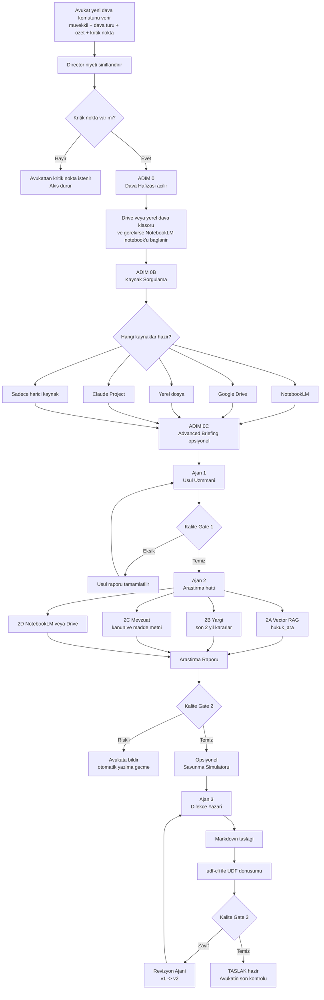

# Dava Is Akisi ve Sistem Diyagrami

Projeyi okuyunca gorunen yapi su: bu repo tam baglanmis bir backend uygulamasindan cok, `Director Agent` merkezli bir dava orkestrasyon sistemi. Yani "bir davayi sisteme soylemek" dediginizde asil isleyen sey; kural dosyalari, ajan rolleri, dava klasoru ve uretilen ara ciktilar zinciri. Bu zincirin ana tanimi `CLAUDE.md`, ajan davranislari ise `ajanlar/` altindaki `SKILL.md` dosyalarinda.

Not: ornek dava klasorleri repo icinde duruyor ama belgeye gore aktif dosyalar artik Google Drive tarafinda tutuluyor.

## Is Diyagrami

## Adim Adim Akis

1. Siz davayi su formatta veriyorsunuz: `yeni dava: [isim], [tur]`, `ozet: ...`, `kritik nokta: ...`. En kritik alan `kritik nokta`; yoksa sistem tahmin etmiyor, durup sizden istiyor.

2. Director once niyeti siniflandiriyor: yeni dava mi, sadece usul mu, sadece arastirma mi, dilekce mi. Yeni dava ise tam hat calisiyor.

3. Ilk gercek operasyon `Dava Hafizasi` acmak. Burada dava icin klasor veya memory alani kuruluyor: Drive klasoru, yerel klasor, gerekirse NotebookLM notebook'u. Bu hafiza dosyasi sistemin omurgasi; hangi ajan bitti, siradaki adim ne, hangi kaynak secildi burada tutuluyor.

4. Hafiza acilir acilmaz zorunlu `Kaynak Sorgulama` geliyor. Sistem sunu soruyor: bu dava icin NotebookLM var mi, Drive klasoru var mi, yerel dosya var mi, Claude Project var mi, yoksa sadece harici kaynaklarla mi gidilecek. Bu cevap gelmeden Ajan 1 ve Ajan 2 baslamiyor.

5. Sonra opsiyonel ama pratikte cok degerli `Advanced Briefing` aciliyor. Burada dava teorisi, en buyuk risk, karsi tarafin muhtemel savunmasi, ton tercihi, olmazsa olmaz talepler, eksik bilgi ve somut veriler toplaniyor.

6. Bundan sonra ilk calisan uretici ajan `Usul Uzmani`. Arastirmadan once davanin usul zemini kuruluyor: gorevli veya yetkili mahkeme, dava sartlari, arabuluculuk, zamanasimi, eksik belgeler, riskler, gerekiyorsa kaba hesap.

7. Usul raporu ciktiktan sonra Director kalite kapisi uygular. Dava sarti eksik mi, sure riski var mi, harc veya hesap tahmini notlandi mi, eksik evrak listesi dolu mu; bunlar kontrol edilmeden bir sonraki adima gecilmemesi hedeflenmis.

8. Sonra `Arastirma Ajani` devreye giriyor. Bu ajan tek parca degil; alt iscilerden olusuyor: Vector RAG, Yargi, Mevzuat, NotebookLM veya Drive. Oncelik sirasi mantiken su: kurumsal kutuphane, sonra guncel ictihat, sonra guncel mevzuat, sonra dava ozel dahili kaynak.

9. Arastirma ciktisi `02-Arastirma/arastirma-raporu.md` olur. Icinde kullanilan kaynaklar, mevzuat, guncel kararlar, celiskiler ve "dilekceye tasinacak argumanlar" bulunur.

10. Risk yuksekse veya siz isterseniz `Savunma Simulatoru` calisiyor. Bu asama karsi tarafin en guclu savunmalarini cikariyor ve her biri icin bizim cevabi uretiyor.

11. Ancak usul ve arastirma yeterli kaliteye gelirse `Dilekce Yazari` baslatiliyor. Bu ajan usul raporu, arastirma raporu, buro kurallari ve briefing'i birlestirip olaylar, hukuki degerlendirme, deliller, hukuki nedenler ve sonuc-talep bolumunu yazar.

12. Dilekce metni hazir olunca son format UYAP icin `.udf`'ye cevriliyor. Bunun icin repo icindeki `udf-cli` kullaniliyor: `npx udf-cli md2udf <input.md> <output.udf>`.

13. Istenirse veya kalite kapisinda zayiflik cikarsa `Revizyon Ajani` devreye giriyor. Bu asama "v1 iyi mi, nereden gol yer, ispat yuku bos mu, netice-i talep hesapla uyumlu mu" diye ic denetim yapiyor.

14. Tum ciktilar "taslak" mantiginda. Sistemin kendi kurali su: hicbir ajan ciktisi final sayilmiyor, avukat son kontrol yapmadan belge kullanilmiyor.

## Sezen Orneginde Gercek Veri Akisi

- Briefing'de kritik risk olarak `devamsizlik savunmasi` ve `elden ucret` yazilmis.
- Usul raporu bunu usul riskine cevirip `ihtarname eksikligi` ve `devamsizlik savunmasi riski` diye isaretlemis.
- Arastirma raporu tam bu noktayi calismis: `m.24/II-e`, `eylemli fesih`, `elden ucret ispati`.
- Savunma simulasyonu karsi tarafin `25/II-g devamsizlik` ve `asgari ucret` savunmasini onden cikarmis.
- Dilekce de bu yuzden daha bastan `eylemli hakli fesih` ve `devamsizlik tutanaklari gecersizdir` omurgasiyla yazilmis.

## En Kritik Halkalar

Bu sistemde dava, tek hamlede "dilekceye donusmuyor". Once hafiza aciliyor, sonra kaynak seciliyor, sonra briefing toplaniyor, sonra usul zemini kuruluyor, sonra arastirma yapiliyor, sonra karsi savunma test ediliyor, en son dilekce yaziliyor ve gerekiyorsa revize ediliyor.

Ozellikle atlanmamasi gereken halkalar sunlar:

- `kritik nokta`
- `kaynak sorgulama`
- `usul raporu`
- `arastirma raporu`
- `kalite gate`

## Ozet Akis Cizgisi

`Yeni dava girdisi -> Director siniflandirma -> Dava Hafizasi -> Kaynak Sorgulama -> Advanced Briefing -> Usul Uzmani -> Kalite Gate -> Arastirma Hatti -> Arastirma Raporu -> Savunma Simulasyonu -> Dilekce Yazari -> UDF Donusumu -> Revizyon -> Avukat Son Kontrol`
