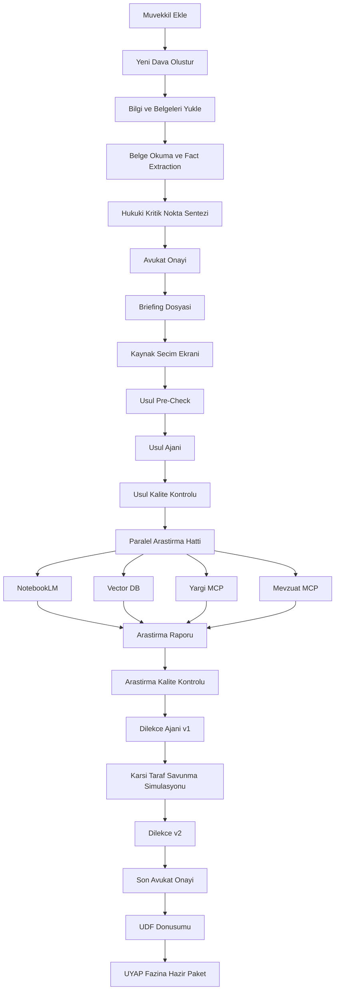

# MERGE.md

## Amac

Bu belge, `HukukTakip site` ile `Claude / CLI / MCP / NotebookLM / Vector DB`
hattinin tek bir dava operasyonuna nasil birlestirilecegini tanimlar.

Buradaki esas senaryo su:

1. Avukat muvekkili siteye ekler
2. Yeni dava acilir
3. Muvekkilden gelen bilgi, not ve belgeler siteye yuklenir
4. Sistem hukuki kritik noktayi sentezler
5. Briefing olusur
6. Avukat arastirma kaynaklarini secip yonlendirir
7. Usul ajani calisir
8. Usul kalite kontrolden gecer
9. Arastirma paralel kaynaklardan yapilir
10. Arastirma kalite kontrolden gecer
11. Dilekce v1 yazilir
12. Karsi taraf savunma simulasyonu yapilir
13. Dilekce v2 yazilir
14. Son metin UDF'ye cevrilir
15. En son asamada UYAP fazi dusunulur

Bu dokumanin hedefi, bu akisi site uzerinden yurutulebilir bir urun planina cevirmektir.

## Temel Yakitim

Bu sistemde site sadece "dosya saklayan panel" olmamali.
Site, davanin operasyon merkezi olmali.

Ajanlarin rolu:

- veri okumak
- sentez yapmak
- rapor uretmek
- taslak yazmak
- kalite kontrol yapmak

Sitenin rolu:

- girdileri toplamak
- hangi ajan ne zaman calisacak buna karar vermek
- ciktilari dava ekranina ve dava klasorune geri yazmak
- avukat onaylarini zorunlu duraklar halinde yonetmek

## Hedef Uctan Uca Akis

## Yeni Dava Geldiginde Site Uzerinden Akis

### 1. Muvekkil ve dava acilisi

Avukat:

- muvekkili ekler
- dava turunu secer
- temel olay ozetini yazar
- ilk hukuki sezgilerini not eder

Site bu asamada su alanlari zorunlu toplamali:

- dava turu
- muvekkil
- karsi taraf
- temel olay ozeti
- avukatin serbest yonlendirme notu
- aciliyet seviyesi
- ilk hedef

Buradaki `avukatin serbest yonlendirme notu` cok kritik.
Cunku hukuki kritik nokta sadece belgelerden degil,
avukatin sezgisinden de beslenmeli.

### 2. Bilgi ve belge yukleme

Avukat veya ekip sunlari yukler:

- muvekkil gorusme notlari
- mesaj goruntuleri
- pdf evraklar
- udf dosyalari
- zip klasorleri
- fotograf ve tarama dosyalari
- onceki dilekce veya kararlar

Bu noktada sistem sadece dosya depolamayi degil, asagidaki on islemleri yapmali:

- dosya turunu tanimlama
- OCR gerekiyorsa OCR kuyrugu
- goruntu / pdf metin cikarimi
- belge ozetleme
- belgeyi iddia ile eslestirme
- evrak checklist guncelleme

Benim ek gorusum:

`Belge yukleme ile hukuki islem arasinda mutlaka bir fact extraction katmani olmali.`

Yani belge sisteme yuksensin, ama hukuki akista kullanilmadan once
`olay`, `tarih`, `taraf`, `iddia`, `delil` kiriliminda okunmus olsun.

### 3. Hukuki kritik nokta sentezi

Bu adim briefing'den once gelmeli.
Bu konuda yon nettir.

Sentez su uc kaynaktan uretilmeli:

1. Avukatin yazili yonlendirmesi
2. Muvekkil gorusme notlari
3. Yuklenen belgelerden cikan olgular

Sistem burada tek bir yazi degil, kontrollu bir cikti uretmeli:

- ana hukuki eksen
- ikinci derecede riskler
- ispat zayifliklari
- eksik bilgi listesi
- eksik belge listesi
- karsi tarafin ilk bakista kullanabilecegi iddialar

Site tarafinda burada bir `Kritik Nokta Onay` ekrani olmali.
Avukat bu sentezi duzeltip onaylamadan briefing'e gecilmemeli.

## Briefing Faz

Kritik nokta netlestikten sonra briefing uretilmeli.

Briefing icermeli:

- olay ozeti
- davanin ana hukuki omurgasi
- muvekkilin talebi
- karsi tarafin beklenen savunma cizgisi
- delil durumu
- eksik bilgi
- eksik belge
- ton ve strateji notu
- acil aksiyon listesi

Site ekraninda briefing icin su alanlar gorulmeli:

- `hukuki kritik nokta`
- `ana hedef`
- `ikincil hedef`
- `en buyuk usul riski`
- `en buyuk ispat riski`
- `eksik belge`
- `eksik bilgi`
- `avukat strateji notu`

Briefing iki yere yazilmali:

- dava workspace'ine markdown artifact olarak
- veritabanina ozet alanlari olarak

## Kaynak Secim Faz

Bu adim otomatik degil, yari otomatik olmali.
Sistem avukata soru sormali.

Sorulacaklar:

- NotebookLM kullanilsin mi
- kullanilacak notebook adi ne
- Vector DB'de hangi koleksiyonlar oncelikli
- Yargi MCP icin tarih araligi / daire / BAM onceligi var mi
- Mevzuat MCP'de hangi mevzuat kapsamda
- ofisin dahili ornek dosyalari kullanilsin mi

Bu cevaplardan bir `research-plan` olusmali.

Site tarafinda burada bir `Kaynak Secimi` paneli olmali.
Her kaynak icin:

- acik / kapali
- not
- oncelik
- filtre

alanlari bulunmali.

## Usul Ajani Hakkinda Net Gorus

Senin sordugun asil mesele bu:

`Usul ajani hangi bilgiyle usul raporu olusturacak?`

Benim net cevabim:

`Usul ajani sadece dava ozetinden beslenmemeli.`

Ama ayni zamanda tam arastirma raporunu bekleyip gec baslamasi da dogru degil.

En dogru model:

- usul ajani briefing sonrasi calissin
- fakat kendisine kontrollu bir `usul paket` verilsin

Bu usul paketi su alanlardan olusmali:

1. Dava metadata
2. Hukuki kritik nokta sentezi
3. Belge ve delil ozetleri
4. Eksik belge ve eksik bilgi listesi
5. Mevzuat MCP'den cekilen dar kapsamli usul kaynaklari
6. Ofisin ic usul checklist'i

Bu sayede usul ajani:

- gorev
- yetki
- dava sarti
- zorunlu on kosul
- sure riski
- ilk usul zaaflari

konularinda isabetli rapor uretebilir.

Benim kesin onerim:

`Usul ajani iki parcaya bolunmeli.`

1. `Usul Pre-Check`
2. `Usul Report Generator`

`Usul Pre-Check` su sorulari sormalidir:

- veri yeterli mi
- dava turu yanlis secilmis olabilir mi
- zorunlu on kosul eksigi var mi
- eksik belge yuzunden usul hatasi riski var mi
- mahkeme secimi sorunlu mu

Bu adim temiz gecmeden usul raporu uretilmemeli.

Bu, `%100'e yakin dogruluk` hedefi icin zorunludur.

## Usul Kalite Kontrol

Usul raporu olustuktan sonra otomatik kalite kapisi calismali.

Kontrol sorulari:

- gorevli mahkeme net mi
- yetki ihtilafi var mi
- dava sarti eksigi var mi
- zorunlu arabuluculuk veya basvuru kosulu var mi
- sure riski var mi
- delil ve belge eksigi usul sonucunu etkiliyor mu
- manuel avukat kontrolu zorunlu mu

Bu kalite kontrol gecilmeden arastirma fazina gecilmemeli.

## Paralel Arastirma Faz

Bu faz, usul raporu temizlendikten sonra calismali.
Burada kaynaklar paralel kullanilmali ama rolleri ayrismali.

Kaynak rolleri:

- `NotebookLM`: dava ozel veya ofis ozel baglam
- `Vector DB`: onceki emsal briefing, dilekce, karar ve bilgi tabani
- `Yargi MCP`: guncel ve ilgili ictihat
- `Mevzuat MCP`: normatif dogruluk ve madde denetimi

Bu fazin girdileri:

- briefing
- kritik nokta
- usul raporu
- kaynak secim plani
- belge ozetleri

Bu fazin ciktilari:

- arastirma raporu
- kaynak kayit listesi
- arguman adaylari
- risk / celiski listesi
- avukata donulecek acik sorular

## Arastirma Kalite Kontrol

Arastirma raporu otomatik kabul edilmemeli.

Kalite kontrol sorulari:

- kaynaklar konu olarak gercekten ilgili mi
- mevzuat guncel mi
- kararlar guncel mi
- kararlar briefing ile uyumlu mu
- kaynaklar birbirini celistiriyor mu
- celiski isaretlendi mi
- dilekceye tasinacak ve tasinmayacak argumanlar ayrildi mi

Burada bir `conflict detector` modulu gerekli.
Ozellikle `NotebookLM / Vector DB / Yargi / Mevzuat` sonuclari birbirine ters dusuyorsa
sistem bunu gizlememeli, acikca gostermeli.

## Dilekce Hatti

### Dilekce v1

Ilk taslak su girdilerle yazilmali:

- briefing
- kritik nokta
- usul raporu
- arastirma raporu
- belge / delil ozeti
- avukat ton tercihi

Bu metin ilk tam taslak olur.

### Karsi taraf savunma simulasyonu

Bu adim ayri bir artifact uretmeli:

- karsi taraf hangi iddiayi one surer
- hangi usul itirazini yapar
- hangi delil zaafini kullanir
- hangi olay yorumunu insa eder

Bu adimin ciktilari:

- `defense-simulation.md`
- `must-answer-list.md`
- `weak-points.md`

### Dilekce v2

Benim gorusum:

`Esas final taslak v2 olmalidir.`

Cunku v1 sadece ilk kurulumdur.
Gercek guclendirme, savunma simulasyonu goruldukten sonra yapilir.

v2'nin gorevi:

- v1'deki bosluklari kapatmak
- karsi taraf savunmalarini onceden gommek
- delil zincirini guclendirmek
- usul zaaflarini temizlemek

## UDF Donusumu

Son avukat onayindan sonra sistem:

1. metni normalize etmeli
2. UDF uretebilmeli
3. UDF'yi dava klasorune yazmali
4. site uzerinde indirilebilir artifact olarak gostermeli

Site tarafinda burada bir `Ciktilar` paneli olmali:

- briefing
- usul raporu
- arastirma raporu
- savunma simulasyonu
- dilekce v1
- dilekce v2
- udf

## Benim Ekledigim Zorunlu Halkalar

Senin senaryona ek olarak bence su halkalar zorunlu:

### 1. Fact extraction

Belgeyi sadece depolamak yetmez.
Belgelerden yapisal olgu cikarimi olmali.

### 2. Source register

Hangi sonuc hangi kaynaga dayaniyor kaydi tutulmali.
Avukat bu zinciri gorebilmeli.

### 3. Review gate

Her buyuk fazdan sonra avukat onayi veya kalite kapisi olmali.

### 4. Conflict detector

Kaynaklar arasi celiski acikca raporlanmali.

### 5. Job orchestration

Bu sistem `tek prompt` mantigiyla yurumemeli.
Her dava icin asama asama ilerleyen bir `job orchestration` olmasi gerekir.

## Site Uzerinden Bunu Nasil Yapariz

Bu akisi gercekten siteye gommek icin asagidaki moduller gerekir:

### 1. Dava detayinda `Arastirma` sekmesi

Burada gorulmeli:

- kritik nokta
- briefing durumu
- kaynak secim plani
- usul durumu
- arastirma durumu
- kalite kontrol sonucu
- acik sorular

### 2. `AI Jobs` tablolari

Onerilen veri yapisi:

- `ai_jobs`
- `ai_job_steps`
- `ai_job_artifacts`
- `ai_job_sources`
- `ai_job_reviews`

### 3. `Artifact paneli`

Tum uretimler tek yerde gorulmeli:

- briefing
- usul raporu
- arastirma raporu
- savunma simulasyonu
- dilekce v1
- dilekce v2
- udf

### 4. `Review / Onay` sistemi

Avukatin onayi gereken duraklar:

- kritik nokta
- briefing
- usul raporu
- arastirma raporu
- dilekce v1
- dilekce v2
- udf oncesi son metin

### 5. `Belge -> olgu -> arguman` izleme hatti

Site su zinciri gosterebilmeli:

`belge -> cikarilan olgu -> hukuki tespit -> rapor -> dilekce bolumu`

Bu olmadan guven ve audit zayif kalir.

## Onerilen Uygulama Sirasi

Bu merge icin benim net onerim su:

1. `Kritik nokta sentez motoru`
2. `Briefing + briefing onay ekrani`
3. `Kaynak secim paneli`
4. `Usul Pre-Check`
5. `Usul raporu`
6. `Usul kalite kontrolu`
7. `Paralel arastirma hatti`
8. `Arastirma kalite kontrolu`
9. `Dilekce v1`
10. `Karsi taraf savunma simulasyonu`
11. `Dilekce v2`
12. `UDF cikti paneli`
13. `Tum surecin artifact ve audit ekranlari`
14. `En son UYAP fazi`

## UYAP En Son Faz

Bu konu bilerek en sona konulmali.

Neden:

- teknik olarak en kirilgan katman bu olur
- imza, istemci, uyumluluk ve audit riski tasir
- once cekirdek hukuki isleyis kusursuza yakin hale gelmeli

Yani once su kisimlar oturmali:

- belge yukleme
- fact extraction
- kritik nokta sentezi
- briefing
- usul
- arastirma
- kalite kontrolleri
- dilekce v1
- savunma simulasyonu
- dilekce v2
- udf

Bunlar guclu sekilde calistiktan sonra ancak:

- `UYAP'a hazir paket`
- `UYAP helper`
- gerekiyorsa daha derin entegrasyon

masaya yatirilmali.

## Son Karar

Senin kafandaki senaryo dogru yonu gosteriyor.
Benim ekledigim en kritik teknik kararlar sunlar:

- `hukuki kritik nokta`, briefing'den once sentezlenmeli
- `usul ajani`, sadece dava ozetinden degil, kontrollu usul paketinden beslenmeli
- `usul pre-check` olmadan usul raporu uretilmemeli
- arastirma fazi paralel olmali ama kaynak rolleri ayrismali
- `dilekce v2`, esas final taslak olarak gorulmeli
- `UYAP`, en son faz olmali
